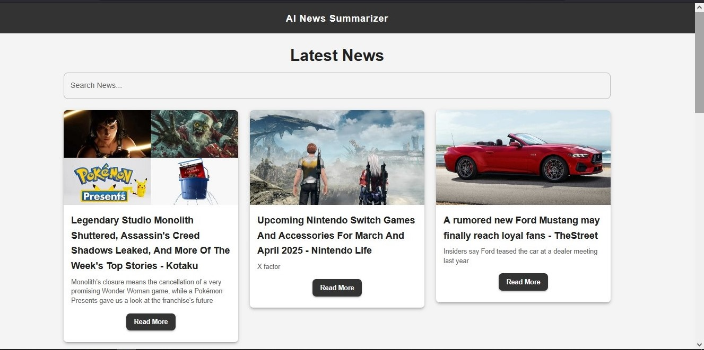

# AI News Summarizer 📰✨

AI News Summarizer is a **MERN stack application** that fetches the latest AI-related news from an external API and provides users with a **clean, responsive, and searchable** news browsing experience.

## 🚀 Features
- 📡 **Live AI News** – Fetches real-time AI news.
- 🔍 **Search Functionality** – Instantly filters news based on keywords.
- 🖼️ **News Cards with Images** – Displays engaging previews.
- 📜 **Pagination Support** – Navigate between pages easily.
- 🎨 **Fully Responsive UI** – Styled with **Material UI**.
- ⚡ **Optimized Performance** – Backend error handling and database optimizations.

## 🛠️ Tech Stack
### **Frontend**
- ⚡ React + Vite
- 🎨 Material UI
- 🔄 Axios (for API requests)

### **Backend**
- 🏗️ Node.js + Express.js
- 🗄️ MongoDB (via MongoDB Atlas)
- 🌍 NewsAPI (for fetching AI news)

## 📦 Installation & Setup

### **1️⃣ Clone the Repository**
```sh
git clone https://github.com/umer-shabir/ai-news-summarizer.git
cd ai-news-summarizer

2️⃣ Install Dependencies
Backend

cd server
npm install

Frontend

cd client
npm install

3️⃣ Set Up Environment Variables

Create a .env file inside the server directory and add:

PORT=5000
MONGODB_URI=your_mongodb_connection_string
NEWS_API_KEY=your_news_api_key

4️⃣ Start the Application
Start Backend

cd server
npm start

Start Frontend

cd client
npm run dev

5️⃣ Open in Browser

Visit:
🔗 http://localhost:5173/ (Frontend)
🔗 http://localhost:5000/news (API Endpoint)

📸 Screenshots
